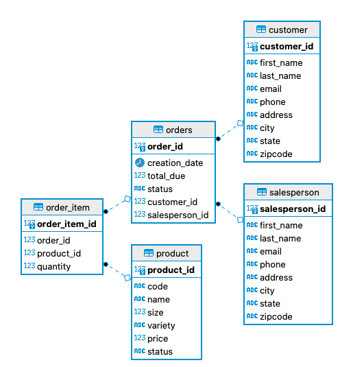

# Introduction
This application is a demonstration of the DAO and Repository Design patterns being implemented using JDBC. Basic CRUD operations were implemented.  

# Implementation
## ER Diagram

## Design Pattern
DAO (Data Access Object) design pattern was implemented to create a layer of abstraction between the DTO and Database layers of the architecture. A DTO (Data Transfer Object) is transferred into the DAO to be modified. This acts as a representation of the row of data within the database.

Repository design pattern was also implemented to join tables within the code rather than using the RDBMS to join tables outside of Java. The Repository Design pattern is implemented by joining a collection of tables to obtain the resultSet instead of designing and joining multiple DAOs. 
