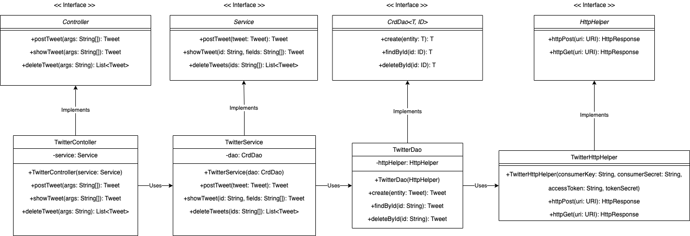

# Introduction
The Twitter CLI app is a Java CLI tool that interacts with the Twitter API. The Twitter CLI app interacts by sending basic CRUD requests. Currently, the app only supports CRD (Create, Read, Delete). The user can post tweets, retrieve tweets, and delete tweets directly using their terminal.

The app is built using Java 1.8, using Maven for build and test automation. The HttpClient is used to send requests to the Twitter API.

The Jackson library was used to convert JSON responses to POJO's so that data can be trasfered throughout the application. The main model used is called Tweet, representing the JSON response returned from CRD requests.

The Spring Framework is used to handle dependency injections

The application can be downloaded directly and built on a local machine, or a docker image can be pulled via 

```bash
#pull docker image from repo
docker pull inthavo2/twitter:latest
```

# Quick Start

## App usage
###post
```bash
USAGE:
TwitterApp "post" "tweet_text" "latitude:longitude"

Arguments:
tweet_text         - tweet_text cannot exceed 140 UTF-8 encoded characters. 
latitude:longitude - Geo location.

Example:
TwitterApp "post" "this is my tweet #abc" "10:10"

Sample JSON output:
{
  "created_at" : "Fri Jun 26 17:32:16 +0000 2020",
  "id" : 1276568976764686343,
  "id_str" : "1276568976764686343",
  "text" : "test post",
  "entities" : {
    "hashtags" : [ ],
    "user_mentions" : [ ]
  },
  "coordinates" : {
    "coordinates" : [ 79.0, 43.0 ],
    "type" : "Point"
  },
  "retweet_count" : 0,
  "favorite_count" : 0,
  "favorited" : false,
  "retweeted" : false
}
```
###show
```bash
USAGE:
TwitterApp "show" "tweet_id" "[field1,fields2]"

Arguments:
tweet_id  - Tweet ID. Same as id_str in the tweet object
[field1,fields2]  - A comma-separated list of top-level fields from the tweet object (similar to SELECT clause in SQL)

Example:
TwitterApp "show" "1276568976764686343"

Sample JSON Ouput:
{
  "created_at" : "Fri Jun 26 17:32:16 +0000 2020",
  "id" : 1276568976764686343,
  "id_str" : "1276568976764686343",
  "text" : "test post",
  "entities" : {
    "hashtags" : [ ],
    "user_mentions" : [ ]
  },
  "coordinates" : {
    "coordinates" : [ 79.0, 43.0 ],
    "type" : "Point"
  },
  "retweet_count" : 0,
  "favorite_count" : 0,
  "favorited" : false,
  "retweeted" : false
}

# optional parameters, returns only requested
TwitterApp "show" "1276568976764686343" "id,text,coordinates"
{
  "id" : 1276568976764686343,
  "text" : "test post",
  "coordinates" : {
    "coordinates" : [ 79.0, 43.0 ],
    "type" : "Point"
  }
}
```

###delete
```bash
USAGE: TwitterApp "delete" "[id1,id2,..]"

Arguments:
tweet_ids - A comma-separated list of tweets.

Example:
TwitterApp "delete" "1276568976764686343"

Sample JSON output:
{
  "created_at" : "Fri Jun 26 17:32:16 +0000 2020",
  "id" : 1276568976764686343,
  "id_str" : "1276568976764686343",
  "text" : "test post",
  "entities" : {
    "hashtags" : [ ],
    "user_mentions" : [ ]
  },
  "coordinates" : {
    "coordinates" : [ 79.0, 43.0 ],
    "type" : "Point"
  },
  "retweet_count" : 0,
  "favorite_count" : 0,
  "favorited" : false,
  "retweeted" : false
}
```

## Installation
## Maven
###1. Package jar file using maven
```
mvn clean package -DskipTests
```
### 2. Run jar file with java CLI tool
```bash
java -jar ./target/twitter-1.2-SNAPSHOT.jar "post|show|delete" "[options]"
```

## Docker

### 1. Pull docker image from DockerHub
```bash
#pull docker image from repo
docker pull inthavo2/twitter:latest
```

### 2. Set environment variables

```bash
# set environment variables using terminal
export consumerKey="consumerKey goes here"
export consumerSecret="consumerSecret goes here"
export accessToken="accessToken goes here"
export tokenSecret="tokenSecret goes here"
```

### 3. docker run
```bash
#run docker container with environment variables
docker run --rm \
-e consumerKey=${consumerKey} \
-e consumerSecret=${consumerSecret} \
-e accessToken=${accessToken} \
-e tokenSecret=${tokenSecret} \
inthavo2/twitter "post|show|delete" "[options]"
```


# Design
The application follows the MVC architecture. Models are POJO's transformed from JSON responses. The views are the JSON data retrieved from requests.

## UML diagram


###app/main
TwitterCLI is the entry point of the java application. There are multiple variations to demonstrate different ways to manage dependency injection. 

* `TwitterCLIApp`
* `TwitterCLIBean`
* `TwitterCLIComponentScan` 
* `TwitterCLISpringBoot`

SpringBoot is the current implementation, but they can be swapped interchangeably.

###controller
The Controller object consumes the user input and calls the appropriate corresponding service method. The implementation is `TwitterController`. The interface is dependent on the `TwitterService`.
###service
The Service layer manages any business logic. The implementation is `TwitterService`. `TwitterService` manages
* Validating tweets
    * The character length is less than 140 characters
    * The latitude and longitude are appropriate values
    * Validating the id 
More business logic can be added where appropriate.

`TwitterService` is dependent on `TwitterDAO` and is used as a dependency in the `Controller` interface.

###dao
Data Access Object manages data from external storage. In our case it only handles the data sent to and retrieved from the Twitter API. The implementation is `TwitterDAO`. This class is dependent on the `HttpHelper` and is used as a dependency in the `Service` interface.   
###httpHelper
Helper class to send `POST` and `GET` requests using `HTTP`. Added as a dependency to the `dao` class to handle data. Implementation is `TwitterHttpHelper`. Implementation uses the `HttpClient` to execute requests.


## Models
Models are converted from JSON to POJO using the Jackson library. The main model is called `Tweet`. This model is built from a collection of other models. `Tweet` models are used as DTO to transfer data throughout the Java Application. Getter and Setter methods are implemented on POJO's to manipulate their data.

###`Tweet`
Main model used to transfer information throughout the Java Application. Contains all the information needed to perform CRD operations. The JSON below is a simplified version of the typical response from the Twitter API. 

More information can be found directly from the Twitter API documentation.

Sample Json
```json
{
   "created_at":"Mon Feb 18 21:24:39 +0000 2019",
   "id":1097607853932564480,
   "id_str":"1097607853932564480",
   "text":"test with loc223",
   "entities":{
      "hashtags":[],      
      "user_mentions":[]  
   },
   "coordinates":null,
   "retweet_count":0,
   "favorite_count":0,
   "favorited":false,
   "retweeted":false
}
```
* `created_at`: time tweet was created
* `id`: unique id of the tweet
* `id_str`: unique id of the tweet, string representation
* `text`: text of the tweet
* `entities`: container mentioning hashtags and user mentions associated with tweet
* `coordinates`: geographical location via latitude, longitude
* `retweet_count`: number of retweets
* `favorite_count`: number of favorite
* `favorited`: boolean if tweet is favorited by user
* `retweeted`: boolean if tweet is retweeted by user

###`Coordinates`
Nested model of tweet. Specifies latitude and longitude of tweet.
###`Entities`
Container mentioning hashtags and user mentions associated with tweet
###`Hashtag`
Model representing a single Hashtag associated with tweet
###`UserMention`
Model representing a user mention associated with tweet

## Spring
Dependency Injections were handled using the Spring Framework. The current implementation is using SpringBoot.

Multiple different approaches were implemented to see their respective pros and cons. These include vanilla Java, bean implementation, and component scan.

To implement our Spring Framework annotations were added in each dependency such as @Component, @Controller, and @Service. The @Autowired annotation is also used to connect dependencies together. 

Though the current project is rather simple use case for Spring, as the number of dependencies start to scale, they can become very difficult to manage. Using Spring saves time and reduces writing code

# Test
TDD (Test Driven Development) was followed to develop this application.
Junit 4 is used to test each class independently. If classes had any dependencies, the Mockito framework was used to mock the dependency's behaviours.


## Deployment

Dockerfile is created using openjdk as its base image. Application is initially packaged before being placed into docker image. Then image is pushed into repo.
```bash
#Create dockerfile
cat > Dockerfile << EOF
FROM openjdk:8-alpine
COPY target/twitter*.jar /usr/local/app/grep/lib/twitter.jar
ENTRYPOINT ["java","-jar","/usr/local/app/grep/lib/twitter.jar"]
EOF

#Package java app
mvn clean package

#build a new docker image locally
docker build -t ${docker_user}/grep .

#push your image to Docker Hubg
docker push ${docker_user}/grep
```


# Improvements
- Specify what JSON tags we want returned for every request instead of only the `"show"` command.
- Be able to collect mulitple tweets at once instead of only one per command call.
- Include the Update feature in CRUD to update an existing tweet from the user.