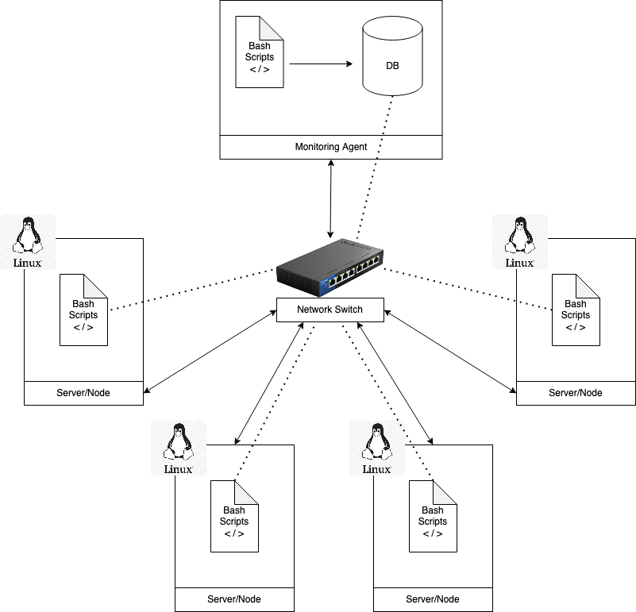

# Introduction

The Jarvis Linux Cluster Administration (LCA) team manages a Linux cluster of nodes/servers running the Linux distribution CentOS 7. These servers are internally connected through a switch and able to communicate through internal IPv4 addresses.

The team needs a product to record hardware specifications and monitor node resource usage in real-time.

This project is meant to be an MVP (minimal viable product) to help the LCA team collect data for future use such as generating reports for resource planning.

We set up a Monitoring Agent on a node within the Linux cluster to collect information such as hardware specifications and resource usage on other nodes within the cluster. This Monitoring Agent contains a PostgreSQL Server installed within a Docker Container that collects information submitted via bash scripts installed on each node.

Set up is simple as we only need to install a few bash scripts on each server/node within the cluster.

# Quick Start
1. Create a `psql` container using `psql_docker.sh` specified with `db_username` and `db_password`

```/scripts/psql_docker.sh create db_username db_password```

2. Start a `psql instance` using `psql_docker.sh`

```/scripts/psql_docker.sh start|stop|create db_username db_password```

3. Create tables using `ddl.sql`
```
#execute a sql file using psql command
psql -h HOST_NAME -p 5432 -U USER_NAME -d DB_NAME -f FILE_NAME.sql
```
4. Insert hardware specs data into the database using `host_info.sh` (Run once)

```./scripts/host_info.sh psql_host psql_port db_name psql_user psql_password```

5.  Insert hardware usage data into the database using `host_usage.sh` (Run @ time intervals using `crontab`)

```./scripts/host_usage.sh psql_host psql_port db_name psql_user psql_password```

- `crontab` setup

```
#edit crontab jobs 
crontab -e 

#add this to crontab subsituting <path>
* * * * * bash <path>/host_usage.sh psql_host psql_port db_name psql_user psql_password
 
#list crontab jobs to verify process is running
crontab -l
```


6. Stop a `psql` instance using `psql_docker.sh` when finished

```/scripts/psql_docker.sh start|stop|create db_username db_password```

# Implementation
A `psql` container is created using Docker to host the `PostgreSQL` database

The `psql` instance is hosted on a single Linux Server/Node. Other Linux Server/Nodes are connected by a switch allowing interaction via IPv4.

Several `bash` scripts are created for automation purposes such as
1. `./scripts/psql_docker.sh`
	- Creating, starting, and stopping a `psql` instance created from `Docker`
2. `./scripts/host_info.sh`
	- Inserting host hardware information into `host_info` table
3. `./scripts/host_usage.sh`
	- Inserting host resource usage data into `host_usage` table

SQL queries such as DDL and DML queries are implemented last. DDL scripts (`ddl.sql`) are used to generate two tables storing hardware specifications and resource usage. DML scripts (`queries.sql`) is used to retrieve information from the two created tables that can help answer relevant business needs such as resource planning.

1. `./sql/ddl.sql`
	- Create `host_info`, `host_usage` tables
2. `./sql/queries.sql`
	- Query from `host_info`, `host_usage` tables

## Architecture 



A Linux cluster is a collection of servers/nodes running the Linux OS connected by a switch. This switch device allows the servers to communicate using IPv4.

- A `psql` instance is installed on a node labeled as `Monitoring Agent`. This `psql` instance is used to store persistent data collected from other nodes within the cluster. 
- A `bash agent` is installed on every node/server within the cluster. This `agent` consists of two scripts.
	- `host_info.sh` collects the host hardware info and inserts them into the `psql` instance. This script is only run once at the installation time.
	- `host_usage.sh` collects the current host usage data then inserts them into the database. It will be scheduled by the `crontab` command to run every minute. 

## Database Modelling
- host_info
Stores Hardware Specific data

|Column                |Type             | Description                     |Example                       |
|--------------------|---------------|-------------------------------|-----------------------------|
|id                  |`serial`         |`primary key` for the host info table | 1
|hostname            |`unique varchar` |`fully qualified name` for each host system |jrvs-remote-desktop-centos7.us-east1-c.c.prefab-mapper-303519.internal |
|cpu_number          |`integer`        |number of cpu(s) on system  |2 |
|cpu_architecture    |`varchar`        |architecture of the cpu     |x86_64 |
|cpu_model           |`varchar`        |model of the cpu            |AMD EPYC 7B12 |
|cpu_mhz             |`real`           |speed of cpu in `mhz`               |2249.998046875
|L2_cache            |`integer`        |storage of L2 cache in `kb`         |512 |
|total_mem           |`integer`        |total memory on host system in `kb` |7492120 |
|timestamp           |`timestamp`      |recorded time in `UTC`              |Feb 5, 2021, 9:17:57 PM |

- host_usage
Stores Linux Resource Data Usage

|Column         |Type        |Description                  		|Example                      |
|---------------|------------|------------------------------------------|-----------------------------|
|timestamp      |`timestamp` |recorded time in `UTC`             	|Feb 5, 2021, 9:17:57 PM      |
|host_id        |`serial`    |`foreign key` for the host info table 	|1 			      |
|memory_free    |`integer`   |free memory in `mb` 			|3811920                      |
|cpu_idle       |`integer`   |idle cpu usage in `percentage` 		|96                           |
|cpu_kernel     |`integer`   |kernel cpu usage in `percentage` 		|0                            |
|disk_io        |`integer`   |number of disk I/O 			|1                 	      |
|disk_available |`integer`   |root directory available memory 		|25905 			      |


## Scripts

### File Structure
```
+-- scripts
|   +-- psql_docker.sh
|   +-- host_info.sh
|   +-- host_usage.sh
+-- sql
|   +-- ddl.sql
|   +-- queries.sql
+-- README.md
```
### Usage
1. `./scripts/psql_docker.sh start|stop|create db_username db_password`
Start or stop a existing container with `psql image` called `jrvs_psql` associated with `db_username`, or create a new docker container called `jrvs_psql` with `db_username` and `db_password`.

2. `./scripts/host_info.sh psql_host psql_port db_name psql_user psql_password`
Collect hardware specification data and upload into db_name within `psql image` in docker container specified by
	- `psql_host`: postgreSQL host name
	- `psql_port`: postgreSQL port (default is 5432)
	- `db_name`: database name
	- `psql_user`: postgreSQL username
	- `psql_password`: postgreSQL password

Note: the script is only run once to collect hardware data.

3. `./scripts/host_usage.sh psql_host psql_port db_name psql_user psql_password`
Collect Linux usage data and upload into `db_name` within `psql image` in docker container specified by 
	- `psql_host`: postgreSQL host name
	- `psql_port`: postgreSQL port (default is 5432)
	- `db_name`: database name
	- `psql_user`: postgreSQL username
	- `psql_password`: postgreSQL password

The script is run by Linux command `crontab` to collect Linux usage data every minute

```
#edit crontab jobs 
crontab -e 

#add this to crontab subsituting <path>
* * * * * bash <path>/host_usage.sh psql_host psql_port db_name psql_user psql_password > /tmp/host_usage.log
 
#list crontab jobs to verify process is running
crontab -l

#verify script is running by checking log file
cat /tmp/host_usage.log
```

4. `./sql/ddl.sql`
Generate `host_info` and `host_usage` tables to store hardware specification data and Linux usage data respectively. Note: The script is run once to generate SQL tables.
```bash
#execute a sql file using psql command
psql -h HOST_NAME -p 5432 -U USER_NAME -d DB_NAME -f FILE_NAME.sql
```
5. `./sql/queries.sql`
SQL script containing multiple queries to answer relevant business questions. Currently has 3 distinct queries implemented to answer 3 different business questions.

a. Group host by hardware info sorted by total memory usage
cpu_number|host_id|total_mem 
|-------|--------------|-------------|
1|1|2048 
1|5|1568 
1|9|1024 
2|4|4088
2|6|1024


b. Average memory usage in percentage over 5 minute intervals
|host_id| host_name| timestamp|avg_used_mem_percentage |
|-------|--------------|-------------|-------------|
|1|node1.jrvs.ca|2019-01-01 00:00:00|97|
|1|node1.jrvs.ca|2019-01-01 00:05:00|90|
|1|node1.jrvs.ca|2019-01-01 00:10:00|65|

c. Detect host failure if sever failed (less than 3 rows of data are collected within 5 minutes)
host_id|timestamp|num_data_points 
|-------|--------------|-------------|
2|2019-01-01 00:10:00|2 

This indicates the server corresponding to `host_id = 2` has failed
```bash
#execute a sql file using psql command
psql -h HOST_NAME -p 5432 -U USER_NAME -d DB_NAME -f FILE_NAME.sql
```

## Tests
1. Bash Scripts
Tests were done manually for all bash scripts. Including creating, starting, and stopping the `psql` instance, and inserting values into `host_usage` and `host_info` tables. 
2. SQL Queries
Query results were verified using mock data created by the developer (me)

## Improvements
- Create a bash script to run `crontab`. Allows for more flexible scheduling. For example, instead of 5-minute intervals, can be 1-minute, 1 day, etc
- Write more queries to answer more business questions
- Write SQL queries in a bash script to allow for flexibility by having user define arguments
- Recommend visualization software for SQL queries to make understanding easier
- Automate handle hardware changes of software of same `host_id`


